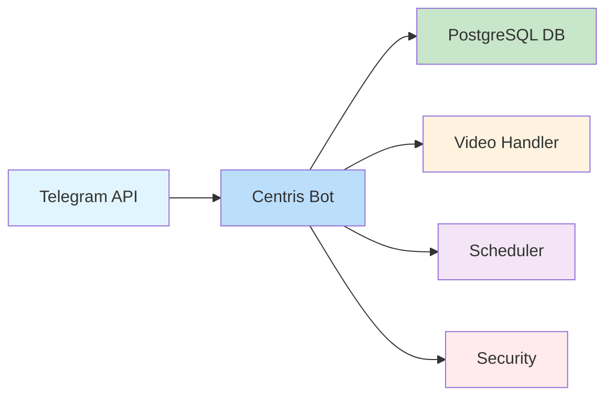
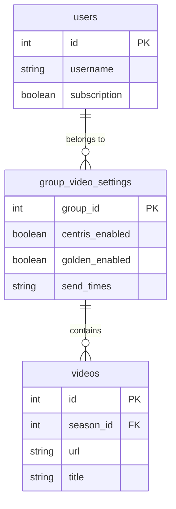

# 🖼️ Rasm Diagrammalar Yaratish va Qo'yish Qo'llanmasi

## 🎯 Maqsad
PowerPoint presentation da professional diagrammalar rasm ko'rinishida qo'yish

## 🚀 Diagramma Yaratish Usullari

### 1️⃣ **draw.io (diagrams.net) - Eng Yaxshi**

#### **Qadamlar:**
1. **draw.io** ga kiring: https://app.diagrams.net/
2. **Create New Diagram** ni bosing
3. **Blank Diagram** ni tanlang
4. **Template** ni tanlang (Software, Database, Flowchart)

#### **Kerakli Diagrammalar:**

##### **🏗️ Bot Arxitekturasi:**
```
[Telegram API] → [Centris Bot Core] → [PostgreSQL Database]
                ↓
        [Video Handler]
        [Scheduler]
        [Security]
```

##### **🗄️ Database Schema:**
```
┌─────────────┐    ┌─────────────────────┐    ┌─────────────┐
│   users     │    │ group_video_settings │    │   videos    │
│             │    │                     │    │             │
│ - id (PK)   │◄──►│ - group_id (PK)     │◄──►│ - id (PK)   │
│ - username  │    │ - centris_enabled   │    │ - season_id │
│ - subscription│  │ - golden_enabled    │    │ - url       │
└─────────────┘    │ - send_times        │    └─────────────┘
                   └─────────────────────┘
```

##### **🎬 Video Tarqatish Jarayoni:**
```
[Vaqt Tekshirish] → [Guruhlarni Olish] → [Videolarni Yuborish] → [Progress Yangilash]
      08:00              Filter Groups         Send to Groups        Update Database
```

### 2️⃣ **Mermaid - Kod Orqali**

#### **Arxitektura Diagrammasi:**


#### **Database Schema:**


### 3️⃣ **Lucidchart - Professional**

#### **Afzalliklari:**
- **Professional ko'rinish**
- **Ko'p template**
- **Kolaboratsiya**
- **Export imkoniyatlari**

#### **Qadamlar:**
1. **Lucidchart** ga kiring
2. **New Document** yarating
3. **Template** ni tanlang
4. **Diagramma** yarating
5. **Export** qiling (PNG/JPG)

## 🖼️ Rasm Formatlari

### **Tavsiya Etilgan:**
- **PNG** - Yuqori sifat, shaffof fon
- **JPG** - Kichik o'lcham, tez yuklanadi
- **SVG** - Vektor, har qanday o'lchamda chiroyli

### **Sifat:**
- **Resolution:** 300 DPI (yuqori sifat)
- **O'lcham:** 1920x1080 yoki undan katta
- **Fon:** Oq yoki shaffof
- **Ranglar:** Professional va chiroyli

## 📱 PowerPoint ga Qo'yish

### **Qadamlar:**
1. **PowerPoint** ni oching
2. **prezentatsiya_v3.pptx** ni oching
3. **Slayd 3** ga o'ting (Bot Arxitekturasi)
4. **Insert → Picture** ni bosing
5. **Diagramma rasm** ni tanlang
6. **Slaydga joylashtiring**

### **Joylashtirish:**
- **Markazda** joylashtiring
- **O'lchamni** moslashtiring
- **Sarlavha** va **izoh** ni saqlang
- **Professional ko'rinish** ni ta'minlang

## 🎨 Diagramma Dizayn Maslahatlari

### **Ranglar:**
- **Asosiy rang:** Ko'k (#0066CC)
- **Ikkilamchi rang:** Yashil (#4CAF50)
- **Uchinchi rang:** Sariq (#FFC107)
- **To'rtlamchi rang:** Qizil (#F44336)

### **Shriftlar:**
- **Sarlavhalar:** Arial Bold, 16-18pt
- **Matn:** Arial Regular, 12-14pt
- **Raqamlar:** Arial Bold, 14pt

### **Elementlar:**
- **To'rtburchaklar:** 4px radius, soya
- **O'qlar:** 2px qalinlik, rangli
- **Matn:** Markazlashtirilgan, o'qilishi oson

## 📊 Har Bir Slayd Uchun Diagrammalar

### **Slayd 3: Bot Arxitekturasi**
- **Turi:** System architecture
- **Elementlar:** Telegram API, Bot Core, Database
- **Bog'lanishlar:** O'qlar bilan

### **Slayd 4: Database Schema**
- **Turi:** Entity Relationship Diagram
- **Elementlar:** Users, Groups, Videos
- **Bog'lanishlar:** Foreign keys bilan

### **Slayd 5: Video Tarqatish**
- **Turi:** Flowchart
- **Elementlar:** 4 ta qadam
- **Bog'lanishlar:** Jarayon yo'nalishi

## 🔧 Texnik Talablar

### **Fayl O'lchami:**
- **PNG:** 500KB dan katta emas
- **JPG:** 1MB dan katta emas
- **SVG:** 200KB dan katta emas

### **O'lcham:**
- **Kenglik:** 800-1200 piksel
- **Balandlik:** 600-900 piksel
- **Aspect ratio:** 4:3 yoki 16:9

### **Sifat:**
- **Resolution:** 300 DPI
- **Ranglar:** RGB, professional
- **Fon:** Oq yoki shaffof

## 🎯 Natija

**✅ Professional diagrammalar rasm ko'rinishida**
**✅ Chiroyli va tushunarli ko'rinish**
**✅ PowerPoint da mukammal ko'rinadi**
**✅ Taqdimot uchun professional**

## 💡 Maslahatlar

1. **draw.io** dan boshlang - bepul va oson
2. **Mermaid** ni sinab ko'ring - kod orqali
3. **Professional ranglar** ishlating
4. **O'qilishi oson** shriftlar tanlang
5. **Test qiling** - har bir slaydda

---

*Tayyorladi: AI Assistant*  
*Sana: 31.08.2025*  
*Maqsad: Professional PowerPoint diagrammalar*
